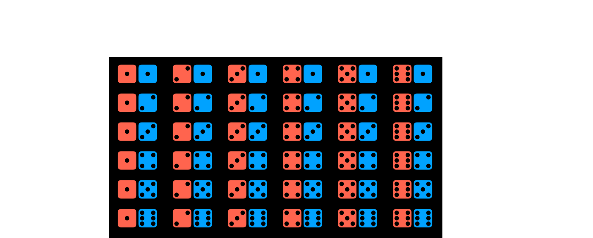
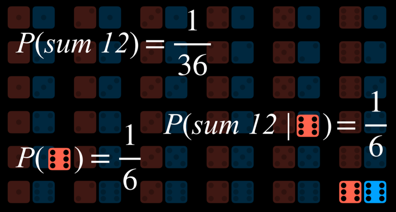

# Week 2: Uncertainty

Na última palestra, discutimos como a IA pode representar e derivar novos conhecimentos. Porém, muitas vezes, na realidade, a IA tem apenas conhecimento parcial do mundo, deixando espaço para incertezas. Ainda assim, gostaríamos que nossa IA tomasse a melhor decisão possível nessas situações. Por exemplo, ao prever o tempo, a IA tem informações sobre o tempo hoje, mas não há como prever com 100% de precisão o tempo amanhã. Ainda assim, podemos fazer melhor do que o acaso, e a palestra é sobre como podemos criar uma IA que tome decisões otimizadas com informações limitadas e incertezas.

## Probability

A incerteza pode ser representada como um número de eventos e a probabilidade, ou probabilidade, de cada um deles acontecer.

**Mundos possíves**

Cada situação possível pode ser pensada como um mundo, representado pela letra grega minúscula ômega $\omega$. Por exemplo, lançar um dado pode resultar em seis mundos possíveis: um mundo em que o dado resulta em 1, um mundo que o dado resulta em 2 e assum por diante. Para representar a probabilidade de um determinado mundo, escrevemos $P(\omega)$.

## Axioms in Probability

- is $0<P(\omega)<1$: every value representing probability must range between 0 and 1.

    * Zero is an impossible event, like rolling a standard die and getting a 7.
    * One is an event that is certain to happen, like rolling a standard die and getting a value less than 10.
    * In general, the higher the value, the more likely the event is to happen.

- The probabilities of every possible event, when summed together, are equal to 1.

$$\sum_{\omega\in\Omega}P(\omega)=1$$

The probability of rolling a number $R$ with a standard die can be represented as $P(R)$. In our case, $P(R) = 1/6$, because there are six possible worlds (rolling any number from 1 through 6) and each is equally likely to happen. Now, consider the event of rolling two dice. Now, there are 36 possible events, which are, again, equally as likely.

  

However, what happens if we try to predict the sum of the two dice? In this case, we have only 11 possible values (the sum has to range from 2 to 12), and they do not occur equally as often.

  

To get the probability of an event, we divide the number of worlds in which it occurs by the number of total possible worlds. For example, there are 36 possible worlds when rolling two dice. Only in one of these worlds, when both dice yield a 6, do we get the sum of 12. Thus, $P(12) = 1/36$, or, in words, the probability of rolling two dice and getting two numbers whose sum is $12$ is $1/36$. What is $P(7)$? We count and see that the sum 7 occurs in 6 worlds. Thus, $P(7) = 6/36 = 1/6$.

**Unconditional Probability**

Unconditional probability is the degree of belief in a proposition in the absence of any other evidence. All the questions that we have asked so far were questions of unconditional probability, because the result of rolling a die is not dependent on previous events.

## Conditional Probability

Conditional probability is the degree of belief in a proposition given some evidence that has already been revealed. As discussed in the introduction, AI can use partial information to make educated guesses about the future. To use this information, which affects the probability that the event occurs in the future, we rely on conditional probability.

Conditional probability is expressed using the following notation: $P(a | b)$, meaning “the probability of event a occurring given that we know event b to have occurred,” or, more succinctly, “the probability of a given b.” Now we can ask questions like what is the probability of rain today given that it rained yesterday $P(rain today | rain yesterday)$, or what is the probability of the patient having the disease given their test results $P(disease | test results)$.

Mathematically, to compute the conditional probability of a given b, we use the following formula:

$$P(a|b)=\frac{P(a ∧ b)}{P(b)}$$

To put it in words, the probability that a given b is true is equal to the probability of a and b being true, divided by the probability of b. An intuitive way of reasoning about this is the thought “we are interested in the events where both a and b are true (the numerator), but only from the worlds where we know b to be true (the denominator).” Dividing by b restricts the possible worlds to the ones where b is true. The following are algebraically equivalent forms to the formula above:

$$P(a ∧ b) = P(b)P(a|b)$$
$$P(a ∧ b) = P(a)P(a|b)$$

For example, consider $P(sum 12 | roll six on one die)$, or the probability of rolling two dice and getting a sum of twelve, given that we have already rolled one die and got a six. To calculate this, we first restrict our worlds to the ones where the value of the first die is six:

  

Now we ask how many times does the event a (the sum being 12) occur in the worlds that we restricted the question to (dividing by $P(b)$, or the probability of the first die yielding 6).

  

## Random Variables

A random variable is a variable in probability theory with a domain of possible values that it can take on. For example, to represent possible outcomes when rolling a die, we can define a random variable Roll, that can take on the values ${0, 1, 2, 3, 4, 5, 6}$. To represent the status of a flight, we can define a variable Flight that takes on the values {on time, delayed, canceled}.

Often, we are interested in the probability with which each value occurs. We represent this using a probability distribution. For example,

- $P(Flight = on time) = 0.6$
- $P(Flight = delayed) = 0.3$
- $P(Flight = canceled) = 0.1$

To interpret the probability distribution with words, this means that there is a 60% chance that the flight is on time, 30% chance that it is delayed, and 10% chance that it is canceled. Note that, as shown previously, the sum the probabilities of all possible outcomes is 1.

A probability distribution can be represented more succinctly as a vector. For example, P(Flight) = <0.6, 0.3, 0.1>. For this notation to be interpretable, the values have a set order (in our case, on time, delayed, canceled).

**Independence**

Independence is the knowledge that the occurrence of one event does not affect the probability of the other event. For example, when rolling two dice, the result of each die is independent from the other. Rolling a 4 with the first die does not influence the value of the second die that we roll. This is opposed to dependent events, like clouds in the morning and rain in the afternoon. If it is cloudy in the morning, it is more likely that it will rain in the morning, so these events are dependent.

Independence can be defined mathematically: events a and b are independent if and only if the probability of a and b is equal to the probability of a times the probability of b: $$P(a ∧ b) = P(a)P(b)$$

## Bayes’ Rule

